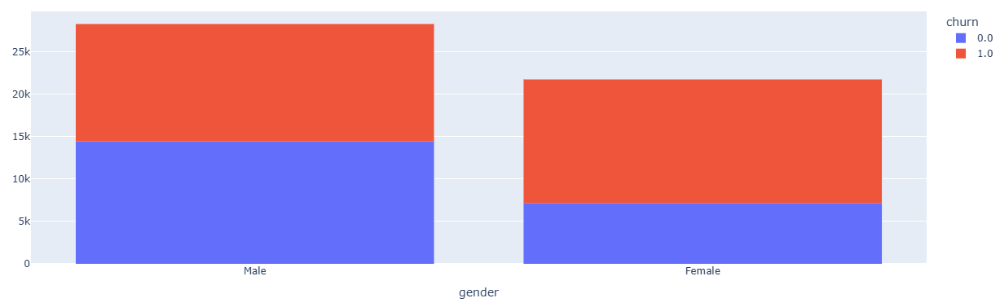
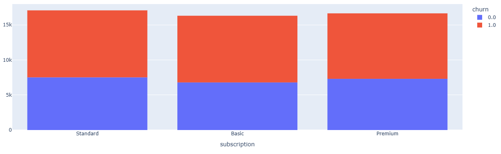
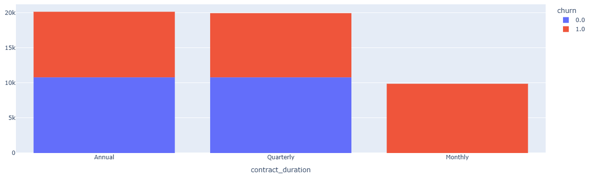
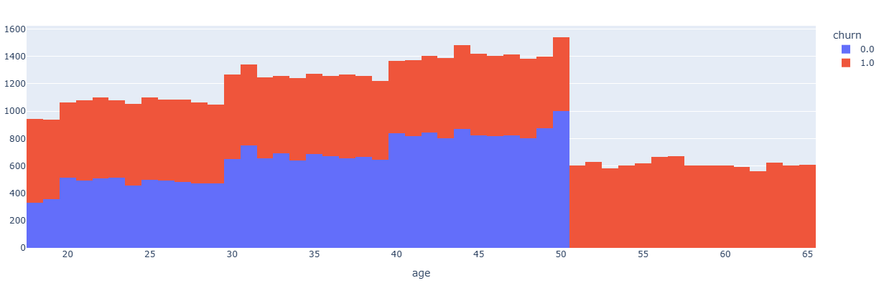
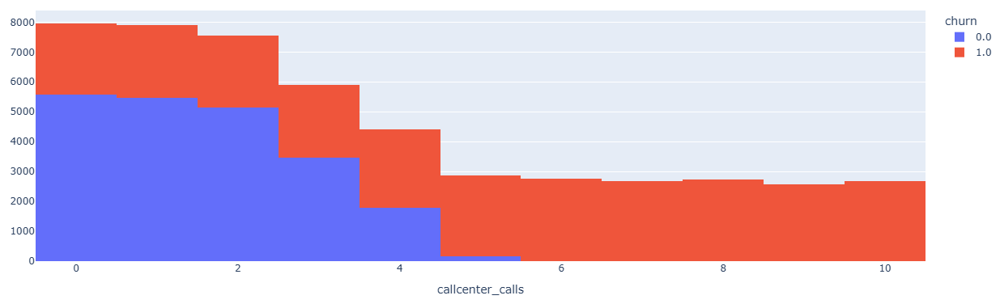
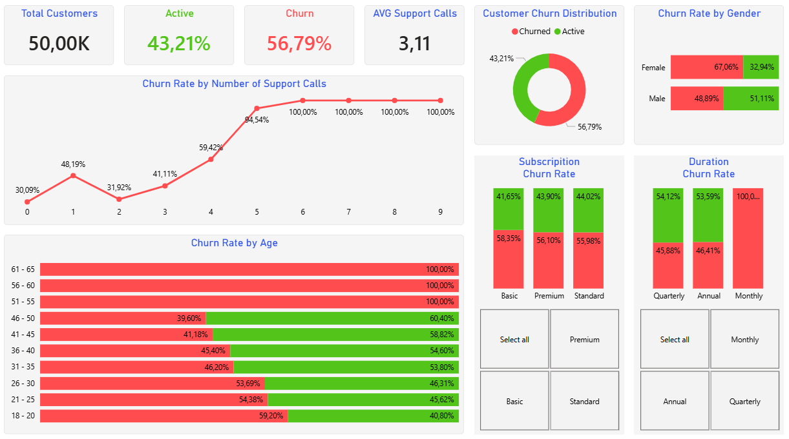

# 📊 Customer Churn Analysis

## 📌 Project Overview

This project aims to analyze customer churn behavior and identify the main factors that lead customers to cancel their subscriptions.

The analysis was conducted in two main steps:

1. Exploratory Data Analysis using Python  
2. Business dashboard development using Power BI  

All insights were initially discovered through Python-generated visualizations and later consolidated into a business-oriented dashboard.

---

# 🐍 Exploratory Data Analysis (Python)

All insights were generated based on exploratory analysis using Python, mainly with Pandas and Plotly.

Below are the key variables analyzed:

---

## 👥 Churn by Gender

**Insight:**

Female customers show a significantly higher churn rate compared to male customers.

**Business interpretation:**

This may indicate differences in customer experience or expectations between genders, suggesting the need for targeted retention strategies.

---

## 💳 Churn by Subscription Type

**Insight:**

Different subscription types present different churn behaviors, with some plans showing higher cancellation rates.

**Business interpretation:**

Certain plans may not be delivering enough perceived value, requiring pricing or benefit adjustments.

---

## 📅 Churn by Contract Duration

**Insight:**

Monthly contracts show extremely high churn rates compared to longer-term contracts.

**Business interpretation:**

Customers with short-term commitments are more likely to leave, while long-term contracts improve retention.

---

## 🎯 Churn by Age

**Insight:**

- Younger customers tend to churn more  
- Middle-aged customers are more stable  
- Some older groups show very high churn (possibly due to low sample size)

**Business interpretation:**

Customer age plays a significant role in retention behavior and should be considered in segmentation strategies.

---

## 📞 Churn by Number of Support Calls

**Insight:**

Churn rate increases significantly as the number of support calls increases, reaching extremely high levels.

**Business interpretation:**

Frequent support interactions are a strong indicator of dissatisfaction.

This is one of the most critical findings of the analysis.

---

# 📊 Business Dashboard (Power BI)

After identifying patterns through Python, the cleaned dataset was used to build an interactive dashboard in Power BI.

## 🖼️ Dashboard Preview

---

## 💡 Business Solution

The dashboard consolidates all insights into a decision-making tool, allowing stakeholders to:

- Monitor churn rate in real time  
- Identify high-risk customer segments  
- Analyze the impact of contract type and support interactions  
- Understand behavioral patterns across demographics  

---

## 🎯 Key Business Recommendations

Based on the analysis:

### 1. Improve Customer Support Experience
High number of support calls is strongly correlated with churn.

👉 Focus on:
- Faster resolution time  
- Better first-contact resolution  

---

### 2. Encourage Long-Term Contracts
Monthly plans have the highest churn rates.

👉 Strategies:
- Offer discounts for annual plans  
- Provide incentives for contract upgrades  

---

### 3. Segment Customers by Profile
Different groups behave differently (age, gender, subscription type).

👉 Actions:
- Personalized offers  
- Targeted retention campaigns  

---

## ⚙️ Technical Stack

- Python (Pandas, Plotly) → Data exploration  
- Power BI → Data visualization and dashboard  
- GitHub → Project versioning and documentation  

---

## 🚀 Conclusion

This project demonstrates how exploratory data analysis combined with business intelligence tools can transform raw data into actionable insights.

The integration of Python and Power BI enables both deep analysis and clear communication, supporting better decision-making.

---

## 👤 Author

Filipe Guerra  
Aspiring Data Analyst
